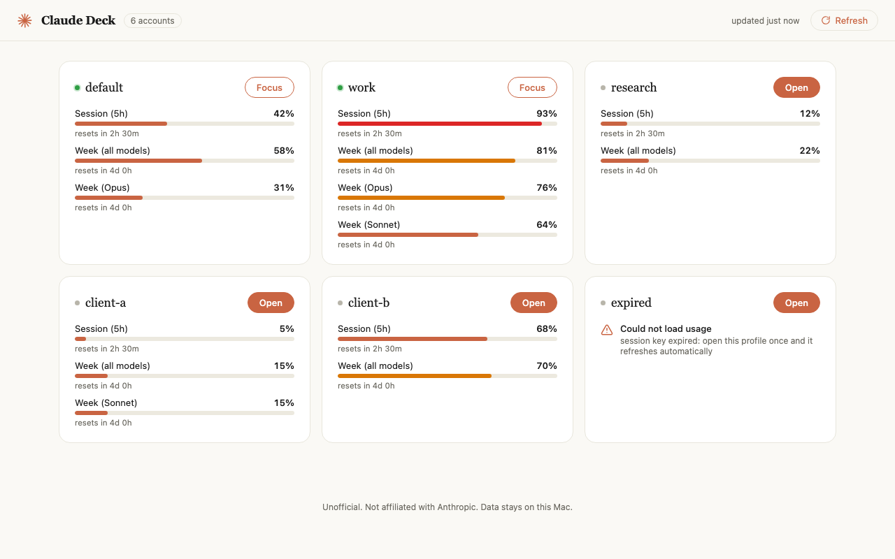

# claude-deck

**Run many Claude accounts side by side on one Mac.** A profile launcher and usage dashboard for the Claude Desktop app.



---

> This is a small vibe-coded utility, and it takes meaningful access: it patches a system app (`Claude.app`) and reads your session cookies. Read the script before you run it.

---

## What you get

- **Unlimited simultaneous logins from one app copy.** No duplicate 700MB Claude.app bundles per account.
- **Every profile shares the same `~/.claude`.** Claude Code sessions, config, and settings are identical across every account you log into.
- **A local dashboard** showing usage per account AND per organization (an account in several orgs gets one section per org), rendering usage windows dynamically from whatever the API returns, so new model buckets (like a Fable weekly limit) show up automatically with no code change, with one-click open or focus per profile.
- **Window titles tagged `[profile]`** so Cmd-backtick, Mission Control, and Raycast can tell your accounts apart.

---

## Quick start

```bash
git clone https://github.com/SMKeramati/claude-deck.git
cd claude-deck
./claude-deck.sh install
claude-deck patch
claude-deck open work   # log in
claude-deck dash
```

Open `http://localhost:8965` to see the dashboard.

---

## Commands

| Command | What it does |
|---|---|
| `claude-deck patch` | Apply the patch. Idempotent, safe to re-run. |
| `claude-deck patch --force` | Re-apply even if already patched. |
| `claude-deck patch --verify-launch` | (dev/testing only, requires `--app <scratch-copy>`) Launch the patched app and confirm it stays alive 8s. |
| `claude-deck revert` | Restore the original `Claude.app` from backup. |
| `claude-deck status` | Show patch state, hashes, backup info, known profiles. |
| `claude-deck open <name>` | Launch Claude with that profile, or focus its window if already running. |
| `claude-deck list` | List known profiles and their cached usage. |
| `claude-deck dash [port]` | Start the local dashboard (default port 8965). |
| `claude-deck install` | Copy the script to `~/.claude-deck/` and add the `claude-deck` alias. |
| `claude-deck uninstall` | Remove the alias only (does not revert the patch). |
| `claude-deck watchdog on\|off` | Auto-reapply the patch whenever Claude updates (needs sudo). |

**Claude must be quit** before `patch` or `revert` (the script tries to quit it for you).

---

## How it works

- **Asar extract, inject, repack.** `/Applications/Claude.app/Contents/Resources/app.asar` is unpacked with `@electron/asar`, a small `claude-deck.js` is written at the asar root and wired into the Electron main process, then the asar is repacked.
- **Info.plist hash fix.** Electron checks a SHA-256 of the asar (`ElectronAsarIntegrity` in `Info.plist`) before it will load it. The script recomputes that hash after repacking and writes it back with `PlistBuddy`.
- **Ad-hoc re-sign, no `--deep`.** The outer app bundle is re-signed so macOS will still launch it. Adding `--deep` would re-sign every nested helper too, which breaks their keychain permissions and makes macOS ask for keychain access on every launch. This script never does that.
- **Entitlements are stripped, not just preserved.** An ad-hoc signature can never carry Apple's restricted entitlements (app identifier, team identifier, keychain groups); macOS's stricter checks on Apple Silicon refuse to launch a binary that has them anyway. The script reads the app's own entitlements, drops those three keys, and adds one that lets the ad-hoc binary still load Electron's genuinely-signed nested framework. See "macOS signing" below.
- **`--profile=NAME` launch flag.** Each profile gets its own Electron `userData` folder under `~/Library/Application Support/Claude Profiles/<name>`, which is what gives it a separate, simultaneous login.
- **Session reporter.** The injected code reads each profile's session cookie and writes it to `~/.claude-deck/profiles/<name>.json`, which the dashboard reads to show usage.

---

## Claude Code sessions across accounts

Profiles share one Claude Code session index (it's symlinked into the default app's own index folder), so every profile of the **same** account sees the same session list instantly. No extra step needed.

To see Claude Code sessions **across different accounts**, use the companion tool [claude-sync](https://github.com/smk-labs/claude-sync): start one throwaway Claude Code session in the new account first, then run claude-sync (or its auto watcher).

> If you're updating claude-deck from an older version, run `claude-deck patch --force` once so this fix takes effect.

---

## App updates remove the patch

Your logins, profiles, and chat history all survive Claude updates: they live outside the app bundle, in `~/Library/Application Support/Claude Profiles/` and `~/.claude`. Only the patch itself is overwritten, because Claude's auto-updater replaces `app.asar` wholesale.

Fix it with either:

```bash
claude-deck patch                # re-apply by hand, ~5 seconds
sudo claude-deck watchdog on     # or: reapply automatically, forever
```

The watchdog is a `launchd` job that watches `Info.plist` for changes. It skips while Claude is running, and it logs to `/var/log/claude-deck.log`.

---

## macOS 26 / Apple Silicon signing

Patching re-signs `Claude.app` ad-hoc (no Apple certificate). An ad-hoc signature can never carry Apple's **restricted** entitlements: `com.apple.application-identifier`, `com.apple.developer.team-identifier`, `keychain-access-groups`. Modern macOS refuses to launch a binary at all if an ad-hoc signature has them.

So the script strips those three and adds `com.apple.security.cs.disable-library-validation`, which lets the ad-hoc-signed app still load Electron's own framework (which stays genuinely Anthropic-signed inside the bundle).

**What this costs you:** hardware-key and passkey login (WebAuthn) may not work in a patched app, because that relied on the keychain groups tied to Anthropic's certificate. **What still works:** password login, Google login, and any session you're already logged into.

`claude-deck revert` restores Claude's original code, but it's still ad-hoc-signed (the same launch requirement applies). For a fully genuine, Anthropic-signed app again, reinstall Claude from anthropic.com.

---

## Security notes

- **Profile key files grant full account access.** `~/.claude-deck/profiles/*.json` holds a live session key per account, mode 600. Keep it out of backups and sync tools: in particular, do not let `claude-sync` or any dotfile sync pick up `~/.claude-deck/profiles/`.
- **The dashboard binds to `127.0.0.1` only** and sends your keys nowhere except `claude.ai`.
- **The watchdog runs a root-owned copy** of itself under `/usr/local/lib/claude-deck`. A script that any user can edit must never run as root, so `watchdog on` copies it there before installing the LaunchDaemon.

---

## Unofficial API, use responsibly

The usage numbers come from the same endpoints `claude.ai`'s own web app uses. They're not a published, stable API: Anthropic can change them at any time without notice. This tool is for personal use and polls gently: the dashboard caches each account for 120 seconds and auto-refreshes every 5 minutes. Not affiliated with Anthropic.

---

## Troubleshooting

**Claude keeps asking for keychain access after patching.**
This means the patch was applied with `codesign --deep` at some point. Run `claude-deck revert` then `claude-deck patch` to get a clean ad-hoc signature on the outer bundle only.

**Claude won't open at all after patching (macOS 26+, Apple Silicon).**
This was a real bug: modern macOS refuses to launch an ad-hoc-signed app that still carries Apple's restricted entitlements. Update claude-deck (`git pull`) and re-run `claude-deck patch`: the current version strips those entitlements automatically. See "macOS 26 / Apple Silicon signing" above.

**Hardware-key or passkey login doesn't work in a patched Claude.**
Expected: see "macOS 26 / Apple Silicon signing" above. Use password or Google login instead, or an account you're already logged into.

**Dashboard shows "session key expired."**
Open that profile once with `claude-deck open <name>`. The key refreshes automatically the next time you're logged in.

**Claude updated and my profiles are "gone" from the launcher.**
Nothing was deleted. Run `claude-deck patch` again: the profile data is still on disk, the patch just needs reapplying.

**Claude would not open at all after patching with an older claude-deck.**
Reinstall Claude once (fresh copy from anthropic.com), update claude-deck (`git pull`), then re-run `claude-deck patch`. Older versions of this script didn't preserve `app.asar.unpacked` (the native modules Electron loads straight off disk), so repacking could silently break the app on newer Claude builds that ship those files. That's fixed now.

---

## Credits

Patch pipeline adapted from [smk-labs/claude-rtl](https://github.com/smk-labs/claude-rtl). Usage-endpoint prior art from [hamed-elfayome/Claude-Usage-Tracker](https://github.com/hamed-elfayome/Claude-Usage-Tracker), [Maciek-roboblog/Claude-Code-Usage-Monitor](https://github.com/Maciek-roboblog/Claude-Code-Usage-Monitor/issues/202), and [lugia19/Claude-Usage-Extension](https://github.com/lugia19/Claude-Usage-Extension).

MIT license. See `LICENSE`.
